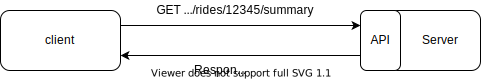
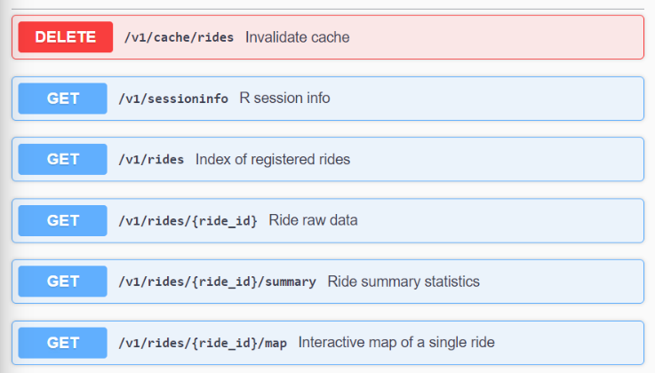

<style>
div.footer {
  position: absolute;
  bottom: 0;
  margin-bottom: 10px;
  width: 80%;
  font-size: 0.6em;
}

.caption {
  font-size: .8rem
}

slides > slide.title-slide hgroup h1 {
  font-size: 36pt;
}

.forceBreak { -webkit-column-break-after: always; break-after: column; }
</style>


```{r setup, include=FALSE}
library(here)
library(httr)
library(magrittr)
library(leaflet)
library(leaflet.extras)

knitr::opts_chunk$set(echo = FALSE, warning = FALSE)
```
## Outline

1. Processing location data
2. Web services with R
3. Architecture and code examples
4. Conclusion

<div class="footer">

</div>


## Travel distance from position data {.columns-2}

- The mobile phone records:
    - Geo-position every *x* seconds (varies by device)
    - Positional accuracy
    - Speed

- Outlier-cleanup necessary
- Imputation of gaps necessary (via routing)

<p class="forceBreak"></p>
<p class="forceBreak"></p>

```{r}
create_map <- function(x, hideGroup = "Route", attributionControl = FALSE){
  leaflet::leaflet(
    options = leaflet::leafletOptions(
      preferCanvas = TRUE, 
      zoomControl = FALSE,
      attributionControl=attributionControl
    )
  )  %>%
  leaflet::addProviderTiles(provider = "CartoDB.Positron") %>%
  leaflet::hideGroup(hideGroup) %>%
  leaflet::addCircles(
    data = x$points,
    color = "crimson",
    radius = 1,
    group = "Punkte"
  ) %>%
  leaflet::addPolylines(
    data = x$sf, 
    group = "Route"
  )
}
```

```{r out.width = "100%", out.height="200px", fig.cap="Outliers"}
x1 <- readRDS(here("data/brunn-am-gebirge_klagenfurt-am-woerthersee.rds"))
create_map(x1, hideGroup = "Route") %>% 
  leaflet::setView(15.28,  47.407, 14) %>% 
  leaflet.extras::addFullscreenControl()
```

```{r out.width = "100%", out.height="200px", fig.cap="Gaps"}
x2 <- readRDS(here("data/gross-enzersdorf_simmering.rds"))
create_map(x2, hideGroup = "Route", attributionControl = TRUE)
```


## Travel distance from position data II {data-background=img/cogwheels-bg.svg data-background-size=cover}

1. Remove points where
    - position accuracy is less than 20m
    - reported speed is less than 7kph (walking)
    - calculated speed is greater than 130kph (outliers)
2. Connect points that are close together with straight lines
3. Use external routing service to connect points further than 50m apart

<div class="footer"> 
*reported speed*: Speed according to speed sensor of the device

*calculated speed*: Speed calculated from position & timestamp
</div>


## How do we integrate our R code in production?

Problem: A new journey can be submitted at any time of the day and needs to 
be processed within minutes


> * 🐒 Manually execute the script each time we receive a new journey
>
> * 🧑 Write an R-Script that is callable from the the command line 
>
>     * Makes it hard to ensure a stable R environment
>     * Maintenance of the script involves another party
>      
> * 🚀 Turn your R-code into a web-service!


## Advantages of web services

* Clear separation of concerns ("good fences make good neighbors")
* Virtually all programming languages can use HTTP APIs
* Execution environment can be tightly controlled
* Easy to deploy different version of the service (dev, test, prod)
* A service is reusable and not limited to a single project
* (for our project) We could re-use existing code from a different project

<div class="footer" style = "width:50%"> 
*Web Service*: A service that runs on a server and responds to requests (usually via HTTP) 

*HTTP*: A protocol for computers to communicate with each other

*API*: Application Programming Interface: A part of a program that enables it to communicate with other programs
</div>


## Architecture
<div class = "columns-2">
  * Mobile-App communicates with backend
  * Backend communicates with geoprocessing service
  * Geoprocessing service communicates with external routing service
  
  Each component can easily be replaced as long as its API stays stable!
  
  <p class="forceBreak"></p>
  
  <center></center>
</div>


## Server code {.smaller}

```{r echo = TRUE, eval = FALSE}
#* Calculate the fastest route 
#* @param ride_id integer id 
#* @response 400 Impossible Route Rrror: routing not possible (e.g. Islands)
#* @response 504 Gateway Timeout Error: routing backend may be down.
#*
### <b>
#* @get /v1/rides/<id>/summary
### </b>
rides_summary <- function(
  id = "",  # from the path definition above
  res   # special plumber object: the Response
){
  r <- tryCatch({
    calculate_fastest_route(id)
  },
    impossible_route_error = function(e){res$status <- 400},
    gateway_timeout_error = function(e){res$status <- 504}
  )

  r
}
```

<div class="footer" style = "width:50%"> 
<span style="font-size:0.6em">[HTTP status codes](https://tools.ietf.org/html/rfc7231#section-6)</span>
</div>


## Client code {.smaller}

Sending a GET request from R
```{r echo = TRUE, eval = FALSE}
res <- httr::GET("https://<...>/rides/12345/summary")
httr::content(res)

## $distanceAustria
## [1] 297334.3
## 
## $distanceForeign
## [1] 0
```

Or from the command line
```{bash, eval = FALSE, echo = TRUE}
curl https://<...>/rides/12345/summary
```

<center></center>


## API Documentation 

<center></center>

<div class="footer" style = "width:50%"> 
[HTTP request methods](https://tools.ietf.org/html/rfc7231#section-4)

[OpenAPI specification](https://swagger.io/specification/)
</div>


## Conclusion {.build}

<div>
* HTTP APIs are a powerful tool for patching applications together
* Providing services with well-behaved APIs is a great way for different teams 
  to collaborate on complex IT projects
* The **plumber** package makes it easy to create HTTP APIs for your project
* The **httr** package makes it easy to access HTTP APIs
* Use APIs!
</div>

<div>
<br><br><br>
<table style="border-spacing: 50px;">
<tr>
  <td width = 10%>
    
  </td>
  <td width = 90% style="font-size:1em; text-align:right;">
    <span>*["Anyone who doesn’t do this will be fired. Thank you; have a nice day!"](https://api-university.com/blog/the-api-mandate/)* <br> -- Jeff Bezos</span>
  </td>
</tr>
</table>
</div>


## Further reading {.smaller}

[plumber: An API Generator for R](https://www.rplumber.io/)

[httr: Tools for Working with URLs and HTTP](https://github.com/r-lib/httr)

[HTTP: The Protocol Every Web Developer Must Know](https://code.tutsplus.com/tutorials/http-the-protocol-every-web-developer-must-know-part-1--net-31177)

[Hypertext Transfer Protocol (HTTP/1.1): Semantics and Content](https://tools.ietf.org/html/rfc7231)

[What is REST](https://restfulapi.net/)

The Austrian Road Freight Transport Mobile App - 
[Video](https://www.youtube.com/watch?v=_RpJUSiBZaI&feature=youtu.be) or
[Brochure](https://www.statistik.at/wcm/idc/idcplg?IdcService=GET_PDF_FILE&dDocName=122327) [in German]

[This Presentation](https://github.com/s-fleck/simple-webservices-with-plumber-uros2020)

### Contact

[stefan.fleck@statistik.gv.at](mailto:stefan.fleck@statistik.gv.at)

[https://github.com/s-fleck](https://github.com/s-fleck)


